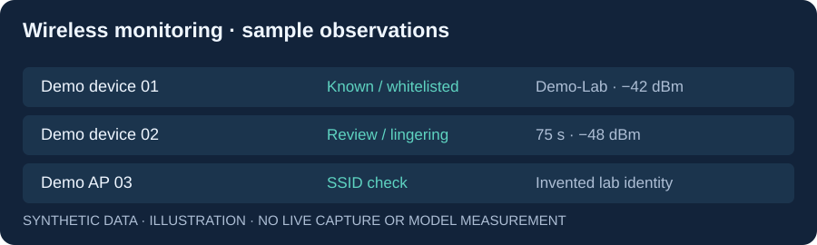

# Wireless Threat Detection

**A passive Wi-Fi monitoring system that turns radio observations into persistent, reviewable security alerts.**

Built by **Dor Cohen** during an R&D internship. This independent portfolio snapshot contains the application and synthetic lab configuration. Deployment credentials, captured device data, original screenshots, and internal handover documents are excluded.


## The problem and the system

A MAC address alone is an unreliable identity signal. Operators also need to distinguish familiar devices, lingering unknown devices, and access points advertising a known SSID with unexpected characteristics.

The system polls Kismet, combines multiple device signals, applies configurable presence and spoofing heuristics, and persists profiles and alerts in **SQLite**. A browser dashboard exposes devices, suspects, alerts, whitelist management, and per-device monitoring through REST and WebSocket updates.

## My contribution

I built the Python detection and integration pipeline, fingerprinting and whitelist workflows, persistent state, and the monitoring interface. The capture layer uses the upstream **Kismet** project; the application is my internship implementation.

**Stack:** Python · FastAPI · Uvicorn · Kismet · SQLite · vanilla JavaScript · Docker.

## Review the engineering

| Start here | What it shows |
| --- | --- |
| [Fingerprinting](app/fingerprint.py) | Multi-signal device profiling |
| [Detection engine](app/logic_engine.py) | Presence, thresholds, and alert decisions |
| [SQLite store](app/db.py) | Persistent profiles, alerts, whitelist, and history |
| [Live runner](app/web/runner.py) | Capture-to-detection integration |
| [Web API](app/web/server.py) | REST and WebSocket monitoring |



The illustration above uses invented device identifiers and SSIDs. It is a data-flow preview, not a live deployment screenshot or a measured detection result. See [synthetic observations](examples/observations.json).

## Run in an authorized Linux lab

Requirements: Docker Compose, a Linux host, and a monitor-mode capable Wi-Fi adapter. Docker Desktop on Windows/macOS is not a substitute for radio access.

```bash
cp .env.example .env
# Edit .env: choose a Kismet password, interface, and your lab SSIDs.
docker compose config --quiet
docker compose up --build -d
```

Open `http://127.0.0.1:8081` for the dashboard and `http://127.0.0.1:2501` for Kismet. The radio container needs privileged host access; the UI and Kismet bind to loopback by default. Keep `.env`, the SQLite database, logs, and captured observations out of Git.

For an existing Kismet installation and Python-only execution, see [setup and operation](docs/SETUP.md). No hardware is needed to inspect the architecture and sample data.

## Limits and evidence

- Fingerprinting, RSSI proximity, and SSID spoofing rules are **heuristics**. They do not establish a person's identity or guarantee detection under MAC randomization.
- Radio coverage, adapter support, environment, and tuning affect results. This snapshot publishes no false-positive rate or accuracy benchmark.
- The dashboard has no built-in multi-user authentication. Use a local lab or an authenticated reverse proxy for any broader access.
- Capture traffic only where you have permission. The implementation is passive; it does not perform deauthentication or credential harvesting.

[Architecture and decisions](docs/ARCHITECTURE.md) · [Publication notes](docs/PUBLICATION.md)
